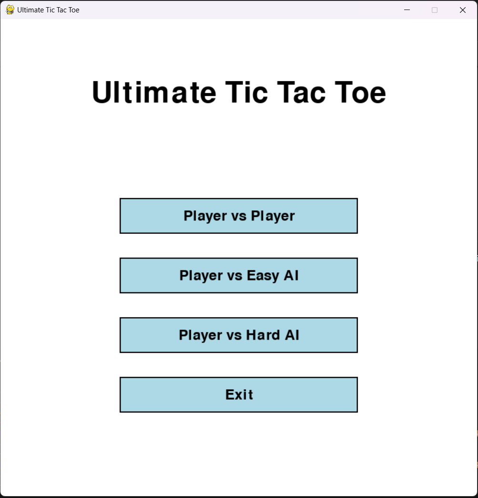
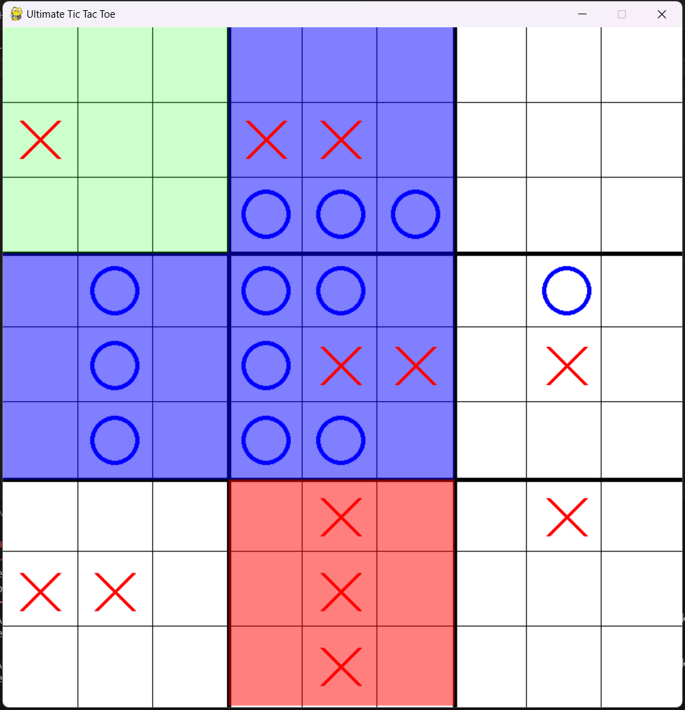

# Ultimate Tic Tac Toe

A Python implementation of Ultimate Tic Tac Toe using Pygame. This game extends the classic Tic Tac Toe concept into a more strategic and complex version.

## Features

- Player vs Player mode
- Two AI difficulty levels:
  - Easy AI (Random moves)
  - Hard AI (Strategic moves using minimax algorithm)
- Interactive GUI with hover effects
- Visual feedback for active boards
- Game state visualization
- Menu system with multiple game modes

## Screenshot




## Requirements

- Python 3.x
- Pygame library 

```bash
pip install pygame
```

## How to Play

1. Run the game:

```bash
python main.py
```

2. Select a game mode from the menu:
   - Player vs Player
   - Player vs Easy AI
   - Player vs Hard AI

### Game Rules

1. The game board consists of 9 small Tic Tac Toe boards arranged in a 3x3 grid.
2. Each turn, the current player must play in the small board corresponding to the cell position of the previous move.
3. When a player wins a small board, they claim that section of the larger board.
4. Win the game by winning three small boards in a row (horizontally, vertically, or diagonally).

### Controls

- Use the mouse to click and place your moves.
- The active board where you can play is highlighted in green.
- If a board is already won or full, the next player can play in any available board.

### Visual Indicators

- X's are shown in red.
- O's are shown in blue.
- Won boards are highlighted with the winner's color.
- The active board is highlighted in green.
- Full boards that end in a draw are marked differently.

## Game Modes

### Player vs Player
- Two players take turns playing against each other.
- Perfect for local multiplayer games.

### Player vs Easy AI
- Play against an AI that makes random moves.
- Good for beginners or casual play.

### Player vs Hard AI
- Challenge yourself against a strategic AI.
- AI uses minimax algorithm to make optimal moves.
- More challenging gameplay.

## Features in Detail

1. **Menu System**
   - Clean, intuitive interface.
   - Easy game mode selection.
   - Exit option.

2. **Game Interface**
   - Clear board visualization.
   - Active board highlighting.
   - Move validation.
   - Turn indicator.

3. **Game Over Screen**
   - Shows winner or draw result.
   - Options to:
     - Play again.
     - Return to main menu.

## Technical Details

- Built with Python and Pygame.
- Implements minimax algorithm for AI.
- Uses object-oriented programming for UI elements.
- Efficient board state management.
- Modular code structure.

## Contributing

Feel free to fork this project and submit pull requests with improvements. Some areas that could be enhanced:
- AI difficulty levels.
- Additional game modes.
- Network multiplayer.
- Score tracking.
- Sound effects.
- Animations.

## License

This project is open source and available under the MIT License.

## Note

AI was used to assist in creating this README file.
